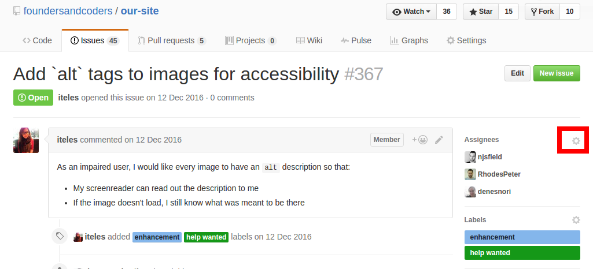

# Learn git

This workshop has been made for students of [Founders and Coders](www.founderandcoders.com), and therefore assumes that you have:
 + created a one-page website before (as part of the [prerequisites](www.founderandcoders.com/apply))
 + completed lesson 1 of [Udacity's Git and GitHub course](https://www.udacity.com/course/how-to-use-git-and-github--ud775) (as part of the [precourse material](https://github.com/foundersandcoders/master-reference/tree/master/coursebook/precourse))
 + created issues on each other's websites (as part of [this accessibilty workshop](https://github.com/jsms90/web-accessibility/blob/master/putting-yourself-in-someone-elses-shoes.md#exercises) on [day 1](https://github.com/foundersandcoders/master-reference/tree/master/coursebook/week-1) of the course)

 **All contributions to this workshop are very welcome!** If you have any suggestions for improvements, please raise an issue, and then follow the [contributing guidelines](./CONTRIBUTING.md) before making a pull request.

## Workshop
Your workshops are designed for collaborative learning, so grab a partner and use one computer.

Now your pair should find another pair and choose one person's one-page website from the [prerequisites](www.foundersandcoders.com/apply) to work on. Make sure the author of the website that you choose is someone who is happy for you to be committing changes.

Each pair should pick a different issue from the ones that were raised in yesterday's [accessibility workshop](https://github.com/jsms90/web-accessibility/blob/master/putting-yourself-in-someone-elses-shoes.md#exercises).

When you start working on issues, you should always "assign" yourself. Assigning yourself let's other collaborators know what you're doing, so they don't also decide to work on that issue. It stops you from duplicating work :+1:

If you can't assign yourself, that's because you're not a member of the organisation that the repo is sitting in, and you haven't been added as a collaborator by the creator of the repo. So repo owners, you'll want to add your team as "collaborators" by going to Settings -> Collaborators, and entering their github handles.
